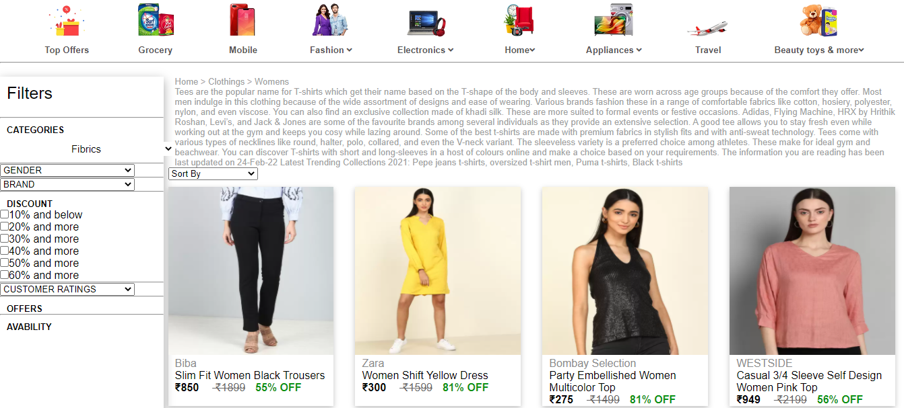
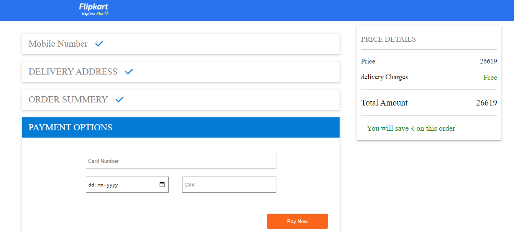

# flipkart.com (clone) 🌐

**flipkart** is an E-commerce platform, 'India ka Fashion Capital', is your one-stop fashion destination for anything and everything you need to look good.

In this project we have tried to make a look alike clone of **flipkart**. With our efforts and the technology stack, that we have learned so far in the masai school, we were able to clone the front end with high precision and quality.

# Technology Stack Used 💻

In this project we have used the following tech stack.

- HTML: [HTML](https://developer.mozilla.org/en-US/docs/Web/HTML)
- CSS: [CSS](https://developer.mozilla.org/en-US/docs/Web/CSS)
- JavaScript:[JavaScript](https://developer.mozilla.org/en-US/docs/Web/JavaScript)

 

## Libraries Used 🌟

1. Images: [Flipkart](https://www.flipkart.com/)
2. Icons:[Awesome Icon](https://www.w3schools.com/icons/fontawesome5_intro.asp)
3. Fonts: [Google Fonts](https://fonts.google.com/)

 

## How to run the project 📑

In this project, we were able to achieve a near to perfect clone of the original website. As we do not want to overwhelm you, we haven't shared all the pages here. Please fork the repository and then use it on your own. If you want to collaborate with us on this project then please feel free to reach out to us.

You can also take a glimpse of our Project, just follow the below steps:

    1. Copy the path of index.html and paste it into your browser.

    2. In the browser you will land on the landing page just Register and login if you have signed up before or do the signup.

    3. On Our website Users can order lunch.

 

## Snapshots 📷

1. Landing Page

   
   
2. Signup Page

   

3. Login Page

   

4. Product Page

   

5. Cart Page

   

6. Cart Page

   

7. Checkout Page

   

 

## Features ✨

1. User can register in web platform.
2. User can apply various sort and filter option on product page
3. User can add the product into Cart and Wishlist page.
4. User can checkout and make a payment

 

## Demo

[Flipkart Clone](https://upbeat-wilson-2fe19b.netlify.app/)

 

## Team Members and Contributors 😇

👤 **Hemant Suryawanshi**

- Github: [hemant-suryawanshi](https://github.com/hemant-suryawanshi)

👤 **Karishma Nikam**

- Github: [Karishma282](https://github.com/Karishma282)

👤 **Salman Khan**

- Github: [Salman-2523](https://github.com/Salman-2523)

👤 **Swapnil Parchake**

- Github: [swapnil-parchake](https://github.com/swapnil-parchake)
